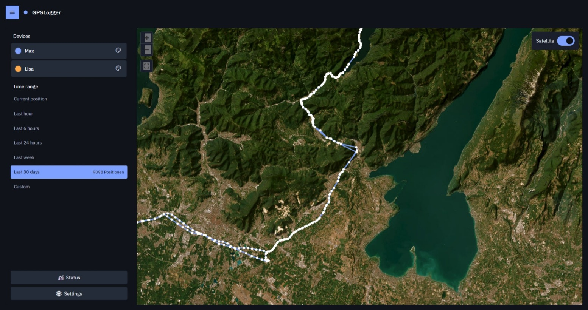
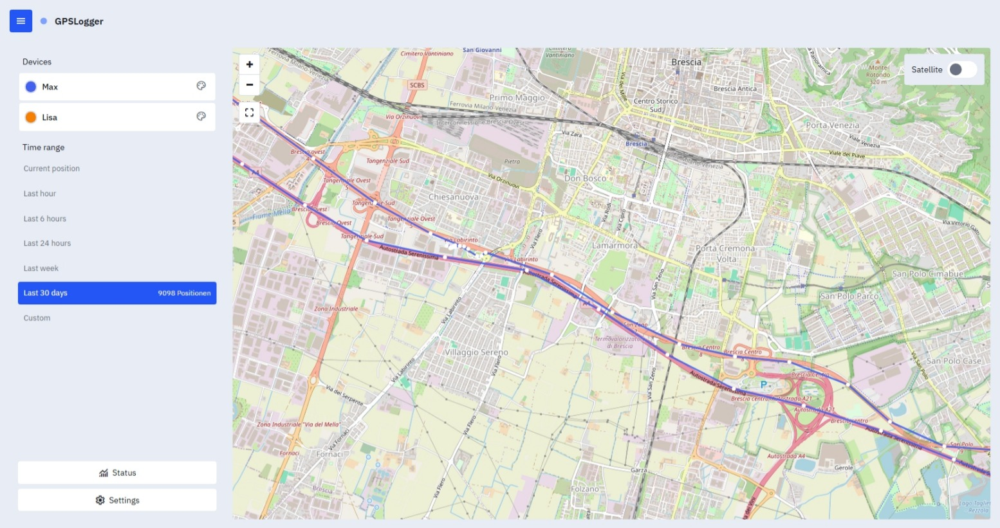
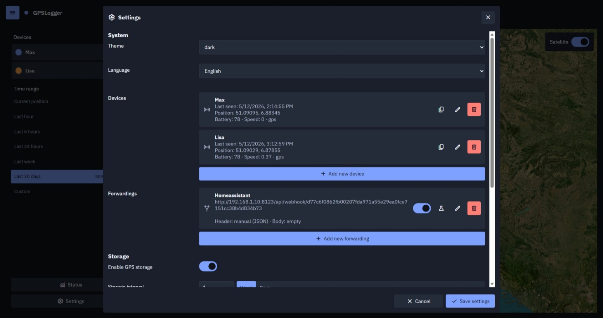
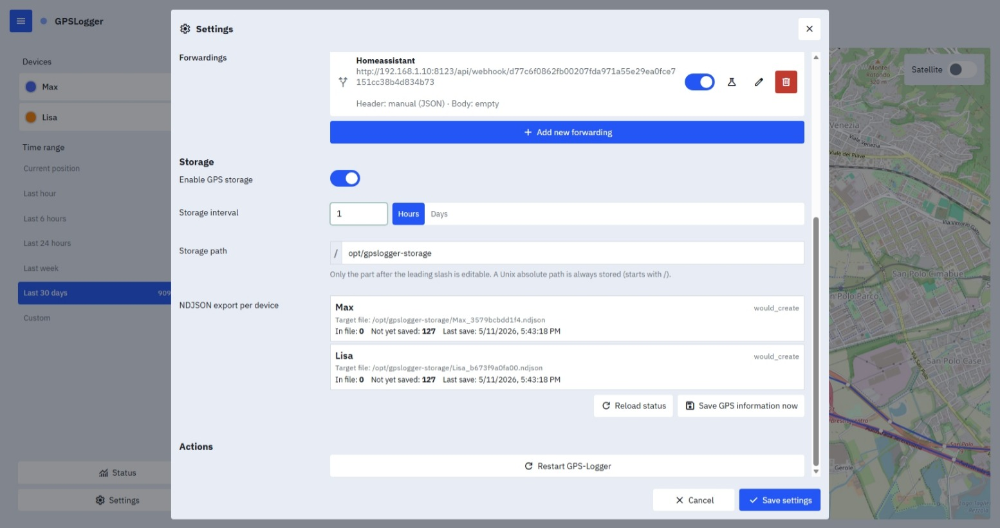

# GPSLogger

Private, lightweight and self hosted GPS position tracking with full control over your own location data.

GPSLogger is a lightweight web application for receiving, storing, visualizing and forwarding GPS positions from your own devices.  
Instead of sending sensitive location data to large cloud providers, your positions stay entirely under your own control on your own server.

Built for people who want:
- privacy
- ownership of their location history
- simple self hosting
- minimal resource usage
- open interfaces
- no vendor lock in


## Screenshots

### Start Page



### Start Page



### Settings



### Settings




# Why GPSLogger?

Most GPS tracking systems require:
- cloud accounts
- proprietary apps
- external databases
- subscriptions
- vendor ecosystems
- permanent internet dependencies

GPSLogger takes a different approach.

Your GPS data:
- stays on your own server
- can be stored as plain JSON files
- remains fully portable
- is easy to back up
- is independent from specific databases
- remains accessible without proprietary systems

You own your location history.


# Open Source from Device to Server

GPSLogger works especially well together with the open source Android app:

https://github.com/mendhak/gpslogger

This creates a completely open source GPS pipeline:
- GPS recording on your phone
- transmission to your own server
- storage under your control
- forwarding to your own systems

No tracking cloud required.


# Typical Use Cases

## Smart Home Presence Detection

Use your own GPS positions to detect:
- arriving at home
- leaving home
- family member presence
- automation triggers

Perfect for Home Assistant and similar systems.


## Photography and Geotagging

Many cameras do not include GPS.

GPSLogger allows external applications to retrieve location data and match it with photo timestamps for:
- photo geotagging
- travel documentation
- archive organization
- map visualization


## Personal Position History

View:
- current device locations
- movement routes
- multiple devices simultaneously
- live updates on the map


## GPS Data Hub

GPSLogger can act as a central position hub.

Applications can:
- receive forwarded positions
- request positions through REST APIs
- access historical position data
- consume live updates

This avoids duplicating GPS logic across multiple systems.


# Features

- lightweight and fast
- self hosted
- privacy focused
- open source
- multiple device support
- live position updates
- route visualization
- forwarding system
- REST APIs
- server sent events (SSE)
- dark and light themes
- mobile friendly UI
- no mandatory database
- JSON based storage
- configurable storage location
- minimal dependencies
- easy backups
- portable data structure


# Installation

## Start directly

```bash
pip install -r requirements.txt
python app.py
```

Afterwards available at:

```text
http://127.0.0.1:8080
```


# Project Structure

```text
app/
├── data/
│   ├── config.json
│   ├── settings.json
│   ├── backups/
│
├── static/
│   ├── css/
│   ├── js/
│   ├── themes/
│   ├── languages/
│   ├── assets/
│
└── app.py
```

---

# Forwardings

GPSLogger can forward incoming positions to other systems.

Examples:
- Smart Home systems
- automation platforms
- custom APIs
- logging systems
- geotagging workflows

This allows GPSLogger to integrate cleanly into existing environments while still keeping your own server as the central source of truth.

---

# API Access

GPSLogger provides REST endpoints for:
- receiving GPS positions
- querying historical positions
- retrieving device information
- live updates

This allows other applications to consume only the data they need.

---

# Lightweight by Design

GPSLogger is intentionally designed to remain:
- simple
- understandable
- maintainable
- resource efficient

No large infrastructure required.

Perfect for:
- small VPS systems
- Raspberry Pi
- home servers
- Proxmox LXCs
- self hosted environments

---

# Privacy First

Location data is among the most sensitive personal information.

GPSLogger is built around the idea that:
- your positions belong to you
- your movement history should remain private
- GPS tracking should not require giving data to third parties

You decide:
- where data is stored
- how long it is stored
- which systems receive it
- who can access it

---

# License

MIT License

---

# Contributing

Contributions, ideas and improvements are welcome.

If you find bugs, have feature ideas or want to improve the project, feel free to open an issue or pull request.
